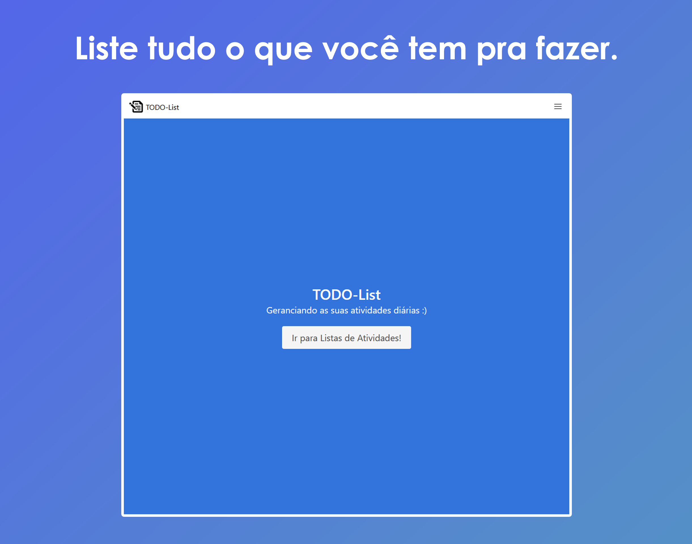
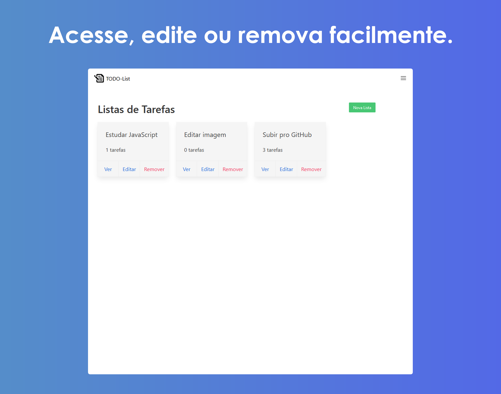

# TODO-List

<h1 align="center">
    
</h1>


## 💻 Sobre o projeto

Um <b>To Do List</b> bem simples, rápido e limpo para estudo das tecnologias citadas aqui no README do projeto.

<br>

<h1 align="center">
    
</h1>

<h1 align="center">
    
</h1>

<br>

## 🧪 Tecnologias usadas

Esse projeto foi desenvolvido com as seguintes tecnologias:

- [EJS](https://ejs.co/)
- [Bulma](https://bulma.io/)
- [MongoDB](https://www.mongodb.com/)
- [JavaScript](https://www.javascript.com/)
- [Node.Js](https://nodejs.org/en/)
- [Express](https://expressjs.com/pt-br/)

## 🔗  Clone a aplicação

Clone o projeto e acesse a pasta do mesmo.

```bash
$ git clone https://github.com/brunofilho1/to-do-list-express/
$ cd to-do-list-express
```
## 🚀 Como iniciar a aplicação

Para iniciá-lo, siga os passos abaixo:
```bash
# Instalar as dependências
$ yarn
# Iniciar o projeto
$ yarn start
```
O app estará disponível no seu browser pelo http://localhost:3000 assim que iniciado.

<h1 align="center">
    
</h1>

## 🌐 Live preview
<a target="_blank" href="">Veja o site online clicando aqui.</a>

## 📝 Licença MIT

Esse projeto está sob a licença MIT. Veja o arquivo [LICENSE](LICENSE) para mais detalhes.

---


